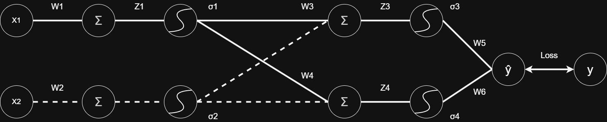
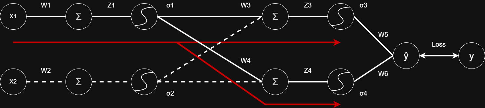
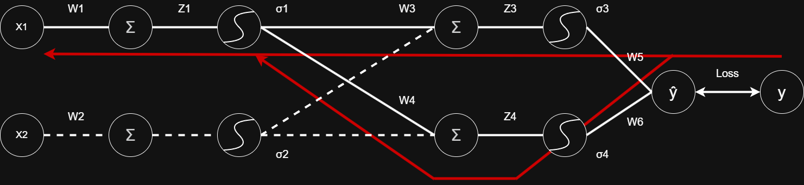

## 0. 神經網路簡易圖

## 1. 向前傳播
向前傳播簡單來講就是指模型從輸入開始一路經過權重 $w$ 、總和 $Σ$ 、啟動函數 $σ$ 的循環最終抵達輸出的位置，代表模型正常使用的運作模式

## 2. 向後傳播 & 梯度下降法
反向傳播跟梯度下降法的使用時機是需要調整權重的時候，一般來講訓練模型的過程中想要根據最終輸出的結果跟實際數值之間的差值來調整參數(W1、W2、W3....)，為了得知要調整的參數對最終輸出的貢獻以及該調整的幅度各有多少，因此會使用梯度下降法來計算這兩個數值。

計算梯度的公式是 $\frac{\Delta loss}{\Delta w_1}$ ，主要概念就是計算Loss函式對w1的偏微分，以2維空間來講就是計算斜率，因此才會稱為梯度。以w1為例，由於w1的梯度沒辦法直接的計算出來，因此需要分別計算w1參與過的節點再統整起來才能得知，也就是分別計算 w5&rarr;w3 以及 w6&rarr;w4 的梯度才能計算出來w1的梯度。在數學上的實現會採用微積分的連鎖律，以下是計算w1梯度的過程(為求計算方便因此啟動函示設定為Relu並假設導數皆為1，例外以 $L$ 表示損失函式):

**1.**

$$
\frac{\partial L}{\partial w_1}
$$

&nbsp;

**2.**

$$
\frac{\partial L}{\partial z_1} \cdot \frac{\partial z_1}{\partial w_1}
$$

&nbsp;

**3.**

$$
\frac{\partial L}{\partial z_1} \cdot x_1
$$

&nbsp;

**4.**

$$
\frac{\partial L}{\partial z_5} \cdot \frac{\partial z_5}{\partial \alpha_1} \cdot \frac{\partial \alpha_1}{\partial z_1} \cdot x_1
$$

（由於 $\dfrac{\partial \alpha_1}{\partial z_1}$ 的結果為 1，因此後續省略）

&nbsp;

**5.**

$$
\frac{\partial L}{\partial z_5} \left( \frac{\partial z_5}{\partial \alpha_3} \cdot \frac{\partial \alpha_3}{\partial z_3} \cdot \frac{\partial z_3}{\partial \alpha_1} + \frac{\partial z_5}{\partial \alpha_4} \cdot \frac{\partial \alpha_4}{\partial z_4} \cdot \frac{\partial z_4}{\partial \alpha_1} \right) x_1
$$

（由於 $\dfrac{\partial \alpha_3}{\partial z_3}$ 與 $\dfrac{\partial \alpha_4}{\partial z_4}$ 的結果皆為 1，因此後續省略）

&nbsp;

**6.**

$$
\frac{\partial L}{\partial z_5} \left( \frac{\partial z_5}{\partial \alpha_3} \cdot \frac{\partial z_3}{\partial \alpha_1} + \frac{\partial z_5}{\partial \alpha_4} \cdot \frac{\partial z_4}{\partial \alpha_1} \right) x_1
$$

&nbsp;

**7.** 

$$
\frac{\partial L}{\partial z_5} \left( w3 \cdot w5 + w4 \cdot w6 \right) x_1
$$

(跳過了計算 $alpha_3$ 跟 $alpha_4$ 過程)

