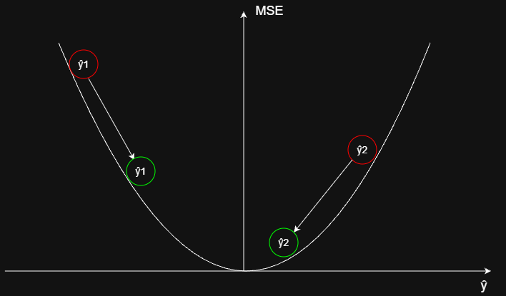
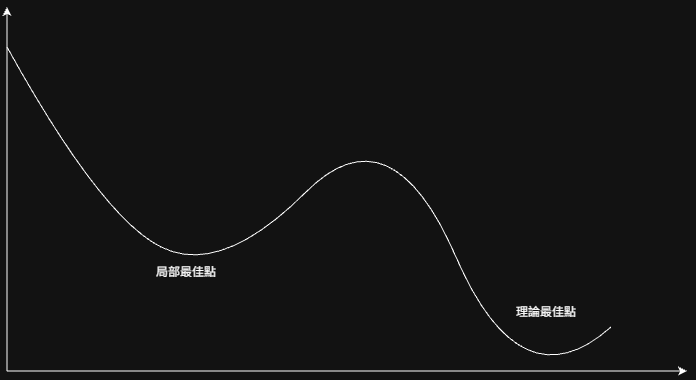
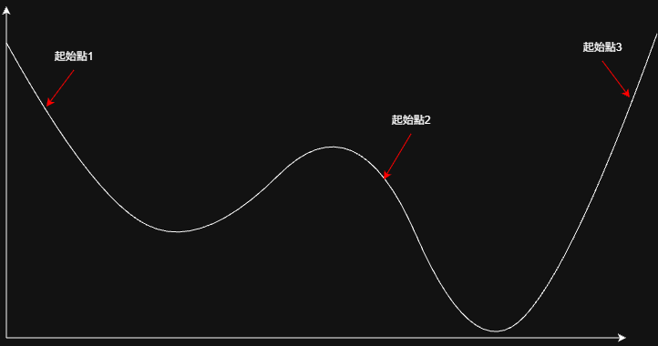

## 1. 演算法前提
在不論是傳統的線性模型還是更大型的神經網路跟Transformers中，都會有模型輸出的 $\hat{y}$ 跟實際答案的 $y$ ，還有一個相對應的損失函數，而根據模型的結構與任務的不同，損失函數也會使用不同的方式定義。

以線性回歸模型為例，常見的損失函數之一為MSE，算法是 $MSE = \frac{1}{n}\sum_{i=1}^{n}(y_i - \hat{y}_i)^2$ ，在這組公式底下如果 $\hat{y}$ 越接近 $y$ ，MSE的結果就會越接近0。而現代的語言模型中，由於輸出的是各個Token的機率，因此常用的損失函數算法是 `Cross-Entropy`，而這套算法也是結果越接近0代表模型效果越好，所以訓練的目的就是讓模型能夠逐步的接近0

## 2. 梯度
如果將損失函數下降的完整函數圖畫出來，並將模型訓練時 $MSE$ 逐步接近0的過程一步步描繪出來， 可以發現損失的點正隨著曲線的坡度逐漸下降，這個坡度就是梯度下降法中的梯度，同時也可以是國中時學到的斜率

## 3. 計算
在更新特定一個權重 $w$ 或 $b$ 時，會使用到下面的公式，其中的 $\eta$ 是學習率，是另一個可以設定的數值，而在 $\eta$ 後面就是計算梯度的算法，透過計算 $Loss$ 對 $w$ 或 $b$ 的導數求得梯度，並用梯度決定更新的幅度以及方向(梯度的正或負)

$$
w_{n+1} := w_n - \eta  \frac{\partial Loss}{\partial w_n}
$$

$$
b_{n+1} := b_n - \eta  \frac{\partial Loss}{\partial b_n}
$$

## 4. 問題點
### 4-1. 局部最佳解
儘管在損失函數為凸的簡單情況下(例如單層線性模型配 MSE 損失)，梯度下降理論上可以收斂到全域最優解，但深度神經網路在前向傳播中疊加了多層非線性轉換後，早期層(甚至中間層)參數所對應的損失曲面會變得崎嶇不平，此時用梯度下降法更新參數可能只會將參數更新到局部最佳點，例如下圖所示

這個問題的解決方法有以下幾種:
1. 設定多個起始點
   
   透過設定多個初始點可以有更高的機會讓參數更新到理論最佳點，但問題也很明顯，第一是設定多少個初始點就代表著要多跑幾次，這在訓練現代大型語言模型的時候意味著要消耗的時間是成倍的增加；第二點是最終的成效可能依舊不是理論最佳點，用成倍的時間換來差不多的效果顯然是不可接受的結果，因此會採用其他的方式
   
3. 隨機梯度下降(SGD)
   
4. Momentum
   

## REF
