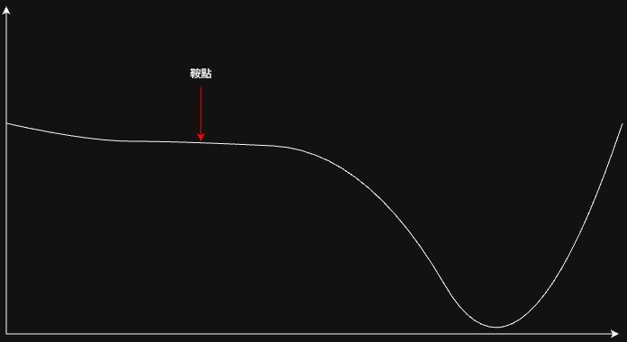
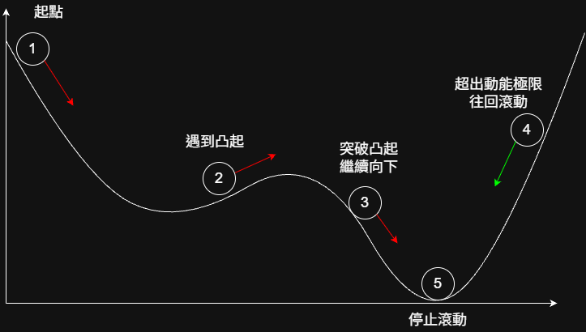

## 1. 演算法前提
在不論是傳統的線性模型還是更大型的神經網路跟Transformers中，都會有模型輸出的 $\hat{y}$ 跟實際答案的 $y$ ，還有一個相對應的損失函數，而根據模型的結構與任務的不同，損失函數也會使用不同的方式定義。

以線性回歸模型為例，常見的損失函數之一為MSE，算法是 $MSE = \frac{1}{n}\sum_{i=1}^{n}(y_i - \hat{y}_i)^2$ ，在這組公式底下如果 $\hat{y}$ 越接近 $y$ ，MSE的結果就會越接近0。而現代的語言模型中，由於輸出的是各個Token的機率，因此常用的損失函數算法是 `Cross-Entropy`，而這套算法也是結果越接近0代表模型效果越好，所以訓練的目的就是讓模型能夠逐步的接近0

## 2. 梯度
如果將損失函數下降的完整函數圖畫出來，並將模型訓練時 $MSE$ 逐步接近0的過程一步步描繪出來， 可以發現損失的點正隨著曲線的坡度逐漸下降，這個坡度就是梯度下降法中的梯度，同時也可以是國中時學到的斜率

## 3. 計算
在更新特定一個權重 $w$ 或 $b$ 時，會使用到下面的公式，其中的 $\eta$ 是學習率，是另一個可以設定的數值，而在 $\eta$ 後面就是計算梯度的算法，透過計算 $Loss$ 對 $w$ 或 $b$ 的導數求得梯度，並用梯度決定更新的幅度以及方向(梯度的正或負)

$$
w_{n+1} := w_n - \eta  \frac{\partial Loss}{\partial w_n}
$$

$$
b_{n+1} := b_n - \eta  \frac{\partial Loss}{\partial b_n}
$$

## 4. 問題點
### 4-1. 梯度鞍點
梯度除了在曲線的頂點附近時會接近0之外，還有一種可能會讓梯度接近0，那就是下圖出現的情況，如果參數訓練時到達鞍點，最差的情況是直接在鞍點結束訓練(梯度為0)，即使沒有停留也由於梯度很低，導致參數更新需要很長一段時間才能離開鞍點

### 4-2. 局部最佳解
儘管在損失函數為簡單曲線情況下(例如單層線性模型配 MSE 損失)，梯度下降理論上可以收斂到全域最優解，但深度神經網路在前向傳播中疊加了多層非線性轉換後，早期層(甚至中間層)參數所對應的損失曲面會變得崎嶇不平，此時用梯度下降法更新參數可能只會將參數更新到局部最佳點，如下圖所示

這個問題的解決方法有以下幾種:
1. 設定多個起始點
   
   透過設定多個初始點可以有更高的機會讓參數更新到理論最佳點，但問題也很明顯，第一是設定多少個初始點就代表著要多跑幾次，這在訓練現代大型語言模型的時候意味著要消耗的時間是成倍的增加；第二點是最終的成效可能依舊不是理論最佳點，用成倍的時間換來差不多的效果顯然是不可接受的結果，因此會採用其他的方式
   
2. 隨機梯度下降(SGD)

   相比於原本計算所有訓練資料的梯度再將其整合的做法，SGD的原理就是只選擇隨機一部分訓練資料並計算梯度，這種方法可以帶來以下的好處:
   1. 減少訓練所需時間
   2. 保留模型隨機性，從而有更有可能避開局部最佳點
  
   但SGD也有其缺點，由於雜訊的影響，參數難以精確收斂到最優解，並且參數的收斂過程也會變得不穩定
   
3. Momentum

   Momentum這個詞代表的含意是動量，核心目的是希望藉由過往梯度累積走出局部最低點的小山坡(?)。用現實生活中的案例來講的話，就是把一個球從起始點滑落，當這個球在滑落的過程中如果遇到路面凸起時，憑藉著先前累積的慣性，看能否突破這個凸起並繼續向下滾動
   在實現上是採用 $0.9 * 過往梯度 + 0.1 * 當前梯度$ 來模擬動能累積的過程，如果某次梯度計算的結果為反向，但數值不足以抵銷過往梯度的累積，則參數更新就會朝著原本的方向進行:反之，就會往回滾動

   

4. Adam(Adaptive Moment Estimation)

   前面的幾種方法都是圍繞在梯度的計算上，但影響滾動的另一個重要因素"學習率" $\eta$ 的問題還沒被解決。在上述的方法中(包含原本的梯度下降)，學習率都是一個固定的值，全部的參數在全部的訓練過程中都使用同一個 $\eta$ ，而實際情況可能是訓練的初期需要較大的學習率，到了收尾階段就需要較小的學習率

## REF
https://chih-sheng-huang821.medium.com/%E6%A9%9F%E5%99%A8%E5%AD%B8%E7%BF%92-%E5%9F%BA%E7%A4%8E%E6%95%B8%E5%AD%B8-%E4%B8%89-%E6%A2%AF%E5%BA%A6%E6%9C%80%E4%BD%B3%E8%A7%A3%E7%9B%B8%E9%97%9C%E7%AE%97%E6%B3%95-gradient-descent-optimization-algorithms-b61ed1478bd7
