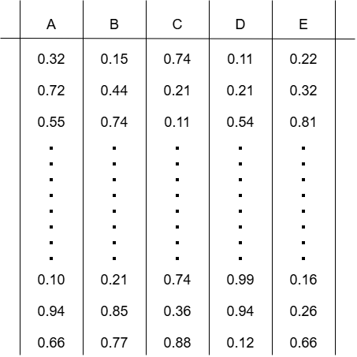
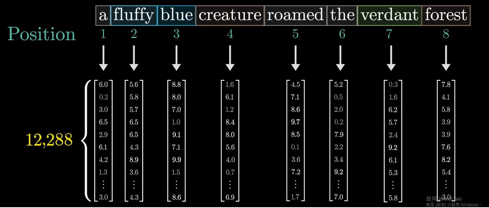
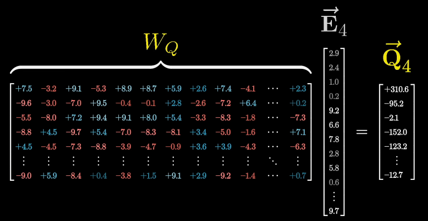
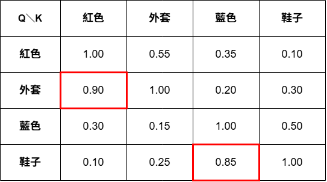
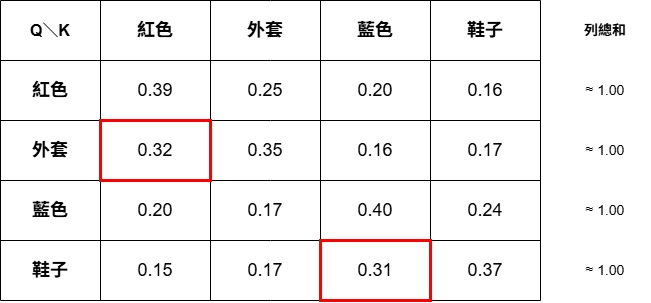
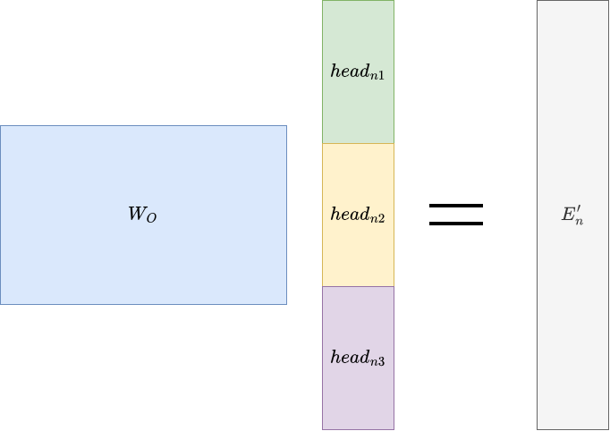
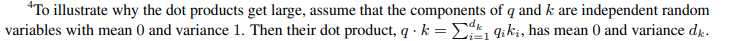

## 背景
在現代的大型語言模型中注意力機制(Attention)是一個非常重要的元件，在 Attention 這套演算法出現以前，先前模型例如 RNN 跟 LSTM 對文字的處理是逐字處理並且是單方向的計算數值變化，雖然已經能夠完成一部分的文字處理任務，例如分類文本、預測下一個詞等，但不管是哪種方法都有嚴重的問題點
1. 處理效率低下:
   
    如果模型需要逐字處理文字才能夠進行後續的任務，這就意味著隨著文本長度的增加，得到輸出所需的時間也會相對應的增加。這個特點使得訓練模型時沒辦法透過平行化處理文本加速訓練，就算透過開啟無限多個執行緒且讓每個執行緒個別處理一筆資料的方式來訓練，也必須等最長的文本被處理完才能夠進行一次參數更新
2. 遠距離文字作用衰退:
   
    RNN 跟 LSTM 是透過隱藏狀態(hidden state)將先前處理過的文字資訊保留下來並傳遞到下一個時間步，但這個傳遞的過程本質上是把所有已讀取的歷史資訊壓縮進一個大小固定的向量中，每經過一次計算，較早的資訊就會被新的輸入覆蓋或稀釋一次。
    
    雖然加入序列的概念能夠有效增加文本處裡的能力，但實際生活中文字與文字之間的關係與位置並不總是相鄰甚至是相近的，甚至前後關係都不一定都是同樣的組合，在這樣的前提下僅靠一次文本分析很難正確提取出所有字詞之間的含義，很可能導致模型錯誤理解文本含義。
   
    假設文本中有一個單詞 `A` ，且這個單詞 `A` 出現在文本的開頭，而文本後段有另一個單詞 `B` 的正確含義必須依賴 `A` 才能判斷，在 RNN 逐字處理的過程中，`A` 的資訊必須經過中間所有字詞對應的時間步驟才能傳遞到 `B` 所在的位置，這段距離越長，`A` 的資訊在傳遞過程中被稀釋或遺忘的機率就越高，最終可能導致模型處理到 `B` 時，已經無法正確參考到 `A` 所提供的關鍵資訊，進而影響對整段文本的理解
    
    LSTM 雖然透過遺忘門、輸入門、輸出門等機制，讓模型能夠選擇性的保留或捨棄部分歷史資訊，一定程度上緩解了這個問題，但當距離拉得夠長時，這樣的機制依然無法完全避免資訊衰退

而Attention機制，或者說是self-Attention機制就能夠解決這兩個問題，第一是Attention能夠平行化處理輸入文本的每一個Token，如此一來單次訓練時間就不會再受限於最長的那個文本，讓訓練極長文本變為可能; 第二是讓每個Token能夠直接接觸文本中所有其他的Token並計算相關程度，這樣得出的文字關聯性就不會再因為距離被稀釋掉

## 算法邏輯
### 文字向量(Embedding)
在處理文字之間的關聯性之前，首先需要將每個文字都轉換成獨立的向量(embedding)，以下方的圖片為例。而每個向量的維度依照不同模型會有所不同，例如google的`gemini-embedding-2`可能的維度有768、1536 或 3072(可根據使用需求調整)。

此時文字之間的數值還是相互獨立，且單一向量中每一個維度代表的值代表每個特定方向的相關度。打個比方來說，第一個維度可能描述的是`是否為生物`，此時數值越大就代表越能代表這個方向的相關程度，反之亦然，甚至會有到負數的可能性。

不過具體哪個維度代表什麼領域或方向並不是由人類決定，而是在訓練過程中由模型自行調整定義的，所以各個維度不一定會是具體語言可描述的方向，畢竟就算用3000多個不同的領域也很有可能無法精準的定義所有文字。

### 關聯性計算
在得到Embedding後，如果直接計算兩組向量之間的相似度的話，最多只能證明這兩個文字有很相似的含義，並不能夠證明這兩個文字在整段文章中有相關性，例如:

> `我買了一件紅色的外套跟一雙藍色的鞋子`

在這個例子中，`紅色`跟`藍色`在語義空間上會是類似的兩個字，但在整段句子中`紅色`應該要對應到的字應該是`外套`，因此需要另一個方式來計算相關性

### Q、K、V 的引入
根據 [3Blue1Brown](https://www.youtube.com/@3blue1brown) 的介紹，Attention另外設計了3個不同功能的向量矩陣，分別是 Q(查詢 Query) 、 K(回應 Key) 、 V(值 Value)，以及位置編碼。
首先是將文字都轉換成向量形式，這點跟剛剛提到的基本一樣，不同的是，此時的數值還加入了位置編碼，這樣模型在訓練的過程中也能學習到文字之間的先後順序

接著就是將這些向量分別跟 Q、 K、 V 這3個矩陣做線性映射，以下面的圖做舉例的話，將任意一個文字 $n$ 分別用 $W_Q$ 、 $W_K$ 、 $W_V$ 做線性映射，然後就會得到 $Q_n$ 、 $K_n$ 、 $V_n$ 。

1. $Q_n$ 的作用類似于該文字針對特定方向做提問，以剛剛提到`我買了一件紅色的外套跟一雙藍色的鞋子`中的`外套`來假設， $Q_{外套}$ 可能的含義就會是 **有哪些形容詞是與我相關的** 或是 **有哪些動詞是與我相關的**，但具體會是哪個方向則完全由 $W_Q$ 來決定
2. $K_n$ 的作用就是負責回應 $Q_n$ 的提問，而計算的方式是直接將任意兩個文字的 Q向量 跟 K向量 做乘積，假設下面這張圖是 `我買了一件紅色的外套跟一雙藍色的鞋子` 的乘積結果，可以發現 `外套` 的詢問中 `紅色` 的結果是最高的(除了 `外套` 跟 `外套` 本身)

3. $V_n$ 的作用就是用於後續的數值更新，根據上一步的 $QK^T$ 取得結果比例做更新，最常見的計算公式是
$$\text{softmax}\left(\frac{QK^T}{\sqrt{d_k}}\right)V$$ 
需要除以 $\sqrt{d_k}$ 的原因會在底下另外說明，接下來 `外套` 這個詞的更新會是以下的算式

$$
V'_{外套} = \text{softmax}\left(\frac{Q_{外套}K^T}{\sqrt{d_k}}\right)V = \sum_{i} \text{softmax}\left(\frac{Q_{外套}\cdot K_i^T}{\sqrt{d_k}}\right) V_i
$$

&emsp;其中 $i$ 會遍歷句子中所有的字，展開後如下：

$$
V'_{外套} = 0.32 * V_{紅色} + 0.35 * V_{外套} + 0.16 * V_{藍色} + 0.17 * V_{鞋子}
$$

&emsp;

&emsp;雖然對 $V_{外套}$ 的處理跟 3Blue1Brown 中提到的方式不太一樣，但本質上還是保留原本 `外套` 的數值，為的是保證更新之後的數值還是能有一定程度的保留原本的含義，差別只在於保留比例的多寡

### 多頭注意力
在上一章有提到 Query 向量會專注于哪種文字特徵提取方向完全取決于 $W_Q$ ，但這會產生一個問題 : Query 向量能查詢到的領域覆蓋程度不夠，為了解決這個問題有兩種可能的方案
1. 擴大 $W_Q$ 的規模，讓它大到足以提取任意的文字特徵方向
2. 設計多個不同 $W_Q$ ， 讓每個 $W_Q$ 專注于不同的特徵提取方向

第一種方案是最簡單能夠採取的方案，簡單的擴大 $W_Q$ 規模代表不需要大幅度的改動注意力機制的架構，僅需調整相對應的部分即可，但這個方法會有兩個很嚴重的問題，第一是擴大規模可能只會讓 $W_Q$ 更傾向採取廣泛、不特定的特徵提取策略 ; 第二是矩陣規模的擴大必然使訓練時間成倍的增加，並且難以精準的更新裡面的參數

相對應的，第二種方案雖然需要重新設計怎麼將各個 Q、K、V 最後的輸出進行整合，但可以讓每個分支分別處理並學習不同的特徵提取策略，並且可以透過平行化處理縮短訓練時間，這也是目前所有大型語言模型採取的策略，而單個 Q、K、V 分支就稱為「單頭注意力」，而多個分支整合起來就是「多頭注意力」

至於要怎麼把各個頭輸出的向量整合起來，原始論文 [Attention Is All You Need](https://arxiv.org/abs/1706.03762) 中採用的方式是直接將輸出頭尾相連接起來，再跟另一個矩陣 $W_O$ 做線性映射，目的是讓各個頭之間的資訊能夠整合。假設針對一個文字 $n$ 的所有注意力頭的輸出為 $head_{n1}$ 、 $head_{n2}$ ... $head_{ni}$ ， 則計算方式會如下圖所示， $E'_n$ 是這次注意力機制更新完後文字 $n$ 新的 embedding

有一點需要注意的是，每一個 $head$ 輸出的維度在原始論文中是 
$$\frac{embedding維度}{總頭數}$$
意思是假如 embedding 維度有 12,288 維、總頭數 64 個，那麼單個 $head$ 輸出的維度就是 192 維

會這樣設計或許是一開始研究團隊把 $head$ 拼接起來的向量直接當作 $E'_n$ 進行輸出，也可能只是因為這樣更直觀，但總之最後推出的版本還是會再跟 $W_O$ 做線性映射，所以理論上不一定要特地將每個 $head$ 的總維度維持跟 embedding 維度相同...嗎?

### 補充 : $\sqrt{d_k}$ 的由來
關於為什麼要在計算關聯程度的時候先將QK乘積除以 $\sqrt{d_k}$ 其實可以再細分成兩個問題
1. 為什麼要除以一個數
2. 為什麼是 $\sqrt{d_k}$

#### 問題1、為什麼要除以數
對於第一個問題，最主要的原因就是 $\text{softmax}$ ，由於這個函數會將原始矩陣中所有的元素轉變成「所有元素總和為1，且單個元素最低為0」的矩陣，不論原始矩陣的範圍有多大。而這意味著 $\text{softmax}$ 是一個很容易被極值影響的函式，例如以下兩組矩陣

$$
\begin{Bmatrix}
-1 & 0.1 & 0.5 & 1
\end{Bmatrix}
$$

$$
\begin{Bmatrix}
-1 & 0.1 & 0.5 & 5
\end{Bmatrix}
$$

這兩組矩陣的差異僅有最大的值從 1 變為 5，但在經過 $softmax$ 轉換之後會得到以下數值(單位：%)

$$
\begin{Bmatrix}
6.299 & 18.923 & 28.231 & 46.545
\end{Bmatrix}
$$

$$
\begin{Bmatrix}
0.242 & 0.729 & 1.088 & 97.939
\end{Bmatrix}
$$

可以看到相同的數值在兩組不同最大值的矩陣中 $softmax$ 之後所佔的比例差距很大，而在做 Q、K 乘積的時候，是有可能出現某幾個數值遠遠大於其他數值的情況，從而導致 $softmax$ 之後數值權重差異過大，不過這件事情的好壞取決於在哪種情況下發生的

1. 在已經訓練完成的模型中發生
代表模型有確實捕捉到這幾個詞跟當前 $Q_n$ 有強烈相關性，因此給這些詞分配大部分的權重，屬於符合預期的情況

2. 在剛開始訓練的模型中發生
剛開始訓練的模型裡面，每一組注意力頭的 $W_Q$ 、 $W_K$ 、 $W_V$ 都是隨機生成的矩陣，用這些矩陣計算出來的 $Q_n$ 、 $K_n$ 乘積自然也會是隨機的。假設此時維度足夠大，足以讓單項 QK 乘積的標準差為 32，就有可能出現以下的矩陣

$$
\begin{Bmatrix}
-20 & 5 & \cdot \cdot \cdot & 32 & 64
\end{Bmatrix}
$$

&emsp;如果用這個矩陣做 $softmax$ ，那麼絕大多數的權重都會被 64 拿走，後續的 $V_n$ 數值更新就會變成以下的算式

$$
V'_n = 0 \cdot V_{-20} + 0 \cdot V_5 + ... + 0 \cdot V_{32} + 1 \cdot V_{64}
$$

&emsp;後續反向傳播中，$W_V$ 只會更新到 64 對應字的參數；但更嚴重的是，$W_Q, W_K$ 幾乎完全沒有梯度可以更新——即便是讓 64 拿到高分的那組參數也一樣，因為 Softmax 飽和之後，輸出結果對任何一個輸入分數的變化都不再敏感。

為了避免出現這種情況，所以需要將矩陣內的數值限縮在一個指定的範圍內，使矩陣內的數值標準差重新變回 1

#### 問題2、為什麼是 $\sqrt{d_k}$
而在解釋第二個問題之前，需要先說明論文中假設的一個前提(第4頁最下方)，任意一個 $Q_n$ 或 $K_n$ 向量的任意一個值的期望值為0，且變異數為1，且維度數為dk

首先，用變異數計算而不是標準差的原因是 : 標準差不能夠直接做加減計算，所以需要先算出變異數，然後再開根號

接下來是計算過程

1. 期望值

$$
\text{E}\left[ QK^T \right] = \sum_{i=1}^{dk}\text{E}\left[q_i \cdot k_i \right]
$$

&emsp;而由於 $q_i$ 跟 $k_i$ 相互獨立，且兩者期望值 $E[x]$ 皆為0，因此可以等效於

$$
E\left[ QK^T \right] = \sum_{i=1}^{dk}E\left[q_i  \right] \cdot E\left[k_i\right] = 0
$$

2. 變異數

$$
\begin{align}
\text{Var}\left[ QK^T \right] &= \sum_{i=1}^{dk}\text{Var}\left[q_i \cdot k_i \right] \\
&=\sum_{i=1}^{dk}\left( E\left[ \left( q_i \cdot k_i \right)^2 \right] - E\left[ q_i \cdot k_i \right]^2\right)
\end{align}
$$

&emsp;&emsp;而 $E\left[ q_i \cdot k_i \right] = 0$

$$
\begin{align}
\text{Var}\left[ QK^T \right] &= \sum_{i=1}^{dk}E\left[ \left( q_i \cdot k_i \right)^2 \right]\\
&= \sum_{i=1}^{dk}\left( E\left[ {q_i}^2 \right] \cdot E\left[ {k_i}^{2} \right] \right)\\
&= \sum_{i=1}^{dk} 1 \cdot 1\\
&=dk
\end{align}
$$

3. 標準差

$$
\begin{align}
\sigma &= \sqrt{\text{Var}\left( QK^T \right)} \\
&=\sqrt{dk}
\end{align}
$$

從上述的計算結果中，在期望值為0，且變異數為1的情況下，QK 乘積的標準差為 $\sqrt{dk}$，而為了將 **標準差縮回 1**，所以需要將乘積除以 $\sqrt{dk}$ ，也就是

$$
\frac{QK^T}{\sqrt{d_k}}
$$

## REF
1. Ashish Vaswani, Noam Shazeer 及其他6人 - [Attention Is All You Need](https://arxiv.org/abs/1706.03762)
1. 3Blue1Brown - [Attention in transformers, step-by-step | Deep Learning Chapter 6](https://www.youtube.com/watch?v=eMlx5fFNoYc)
2. Math py - [[論文] Attention Is All You Need](https://allen108108.github.io/blog/2020/05/13/[%E8%AB%96%E6%96%87]%20Attention%20Is%20All%20You%20Need/)
3. Jay Alammar - [The Illustrated Transformer](https://jalammar.github.io/illustrated-transformer/)
